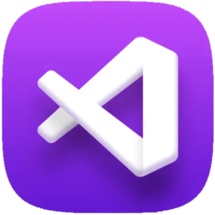
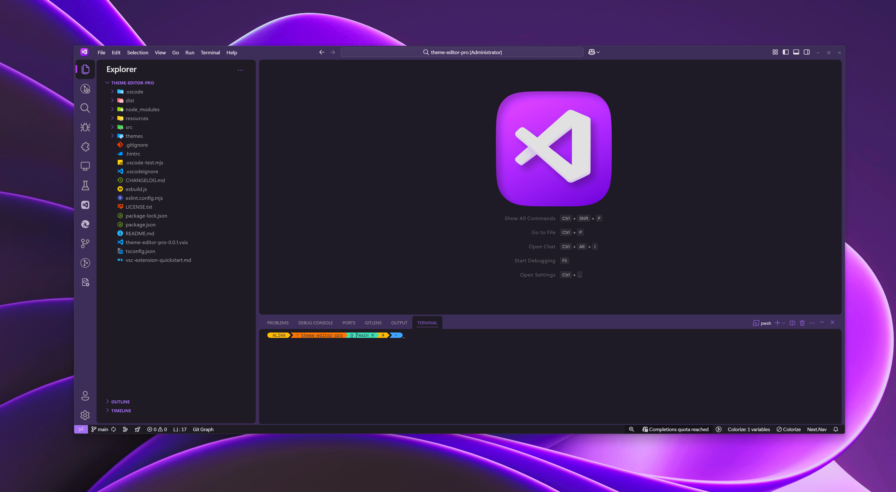
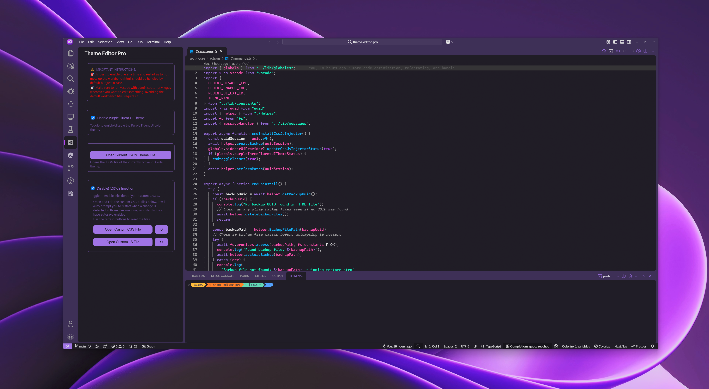

<div align="center">
<h1> 🟪 Theme Editor Pro 🟪</h1>
</div>

<div align="center">



**The Ultimate VS Code Theme Customization Extension**


[](https://marketplace.visualstudio.com/items?itemName=Ali-Kabbadj.theme-editor-pro)
[](https://marketplace.visualstudio.com/items?itemName=Ali-Kabbadj.theme-editor-pro)
[](https://github.com/Ali-Kabbadj/VS-Theme-Editor-Pro/issues)
[](https://github.com/Ali-Kabbadj/VS-Theme-Editor-Pro)
[](https://github.com/Ali-Kabbadj/VS-Theme-Editor-Pro/blob/main/LICENSE)


</div>

---

## 🌟 **What is Theme Editor Pro?**

**Theme Editor Pro** is the most comprehensive VS Code theme customization extension that combines the power of **CSS/JS injection**, **live hot reload**, and a stunning **Purple Fluent UI theme** - all accessible through an intuitive sidebar interface.

Transform your coding environment with real-time customization capabilities and experience the perfect blend of aesthetics and functionality.

---

|                                                                         |                                                                         |
| :---------------------------------------------------------------------: | :---------------------------------------------------------------------: |
|  |  |

---

## ✨ **Key Features**

<div align="center">

|           🎨 **Custom Theming**            |             ⚡ **Live Reload**              |            🎪 **Fluent UI**            |        🔧 **Easy Management**        |
| :----------------------------------------: | :-----------------------------------------: | :------------------------------------: | :----------------------------------: |
| Inject custom CSS/JS directly into VS Code | Instant updates when you modify theme files | Beautiful purple Fluent UI integration | Intuitive sidebar for all operations |

</div>

### 🔥 **Core Capabilities**

- **🎨 CSS/JS Injection System**

  - Directly modify VS Code's appearance with custom CSS
  - Add custom JavaScript for enhanced functionality
  - Secure backup and restore system

- **⚡ Hot Reload Technology**

  - Auto-detection of theme file changes
  - Instant prompt for restart on config change.

- **🎪 Purple Fluent UI Theme**

  - Professionally designed purple color scheme
  - Fluent UI integration for modern aesthetics
  - Optimized for long coding sessions

- **🔧 Intuitive Sidebar Interface**
  - Toggle features with simple checkboxes
  - Direct access to theme files
  - One-click file reset functionality

---

## 🚀 **Installation**

### **Option 1: VS Code Marketplace** _(Recommended)_

1. Open VS Code
2. Go to Extensions (`Ctrl+Shift+X`)
3. Search for **"Theme Editor Pro"**
4. Click **Install**

### **Option 2: Command Line**

```bash
code --install-extension Ali-Kabbadj.theme-editor-pro
```

### **Option 3: Manual Installation**

1. Download the `.vsix` file from [GitHub Releases](https://github.com/Ali-Kabbadj/VS-Theme-Editor-Pro/releases)
2. Open VS Code
3. Press `Ctrl+Shift+P` → Type "Extensions: Install from VSIX"
4. Select the downloaded file

---

## 🎯 **Quick Start Guide**

### **Step 1: Open the Sidebar**

Look for the **Theme Editor Pro** icon in your activity bar: 

### **Step 2: Enable Features**

Use the intuitive checkboxes to enable:

- ✅ **Purple Fluent UI Theme**
- ✅ **CSS/JS Injection**

### **Step 3: Customize**

- Click **"Open Custom CSS File"** to start styling
- Click **"Open Custom JS File"** for advanced customization
- Changes are applied instantly with hot reload!

---

## 🎨 **Purple Fluent UI Theme Showcase**

<div align="center">

_Experience the perfect harmony of purple aesthetics and modern Fluent UI design_

</div>

### **🌈 Color Palette**

- **Primary Purple**: `#bc47ffdd` - Main accent color
- **Dark Background**: `#42304c` - Title bars and panels
- **Deep Purple**: `#2D1B3D` - Sidebar and secondary elements

### **🎪 Theme Features**

- **Modern Fluent UI Integration** - Seamless Microsoft Fluent design language
- **Eye-friendly Purple Tones** - Optimized for extended coding sessions
- **High Contrast Elements** - Perfect readability in all lighting conditions
- **Consistent Color Scheme** - Harmonious throughout the entire interface

---

## ⚙️ **Advanced Configuration**

### **Custom CSS Examples**

```css
/* Glowing cursor effect */
.monaco-editor .cursor {
  box-shadow: 0 0 10px #bc47ff;
}

/* Animated brackets */
.bracket-highlighting-0 {
  color: #bc47ff !important;
  animation: pulse 2s infinite;
}

@keyframes pulse {
  0%,
  100% {
    opacity: 1;
  }
  50% {
    opacity: 0.5;
  }
}

/* Custom scrollbar */
.monaco-scrollable-element .scrollbar {
  background: linear-gradient(45deg, #bc47ff, #9945ff);
}
```

### **Custom JavaScript Examples**

```javascript
// Custom welcome message
console.log("🎨 Theme Editor Pro Activated!");

// Add custom functionality
document.addEventListener("DOMContentLoaded", function () {
  // Your custom VS Code enhancements here
});
```

---

## 🛠️ **Commands & Usage**

### **Available Commands**

- `theme-editor-pro.enableTheme` - Enable Purple Fluent UI Theme
- `theme-editor-pro.disableTheme` - Disable Purple Fluent UI Theme
- `theme-editor-pro.installCssJsInjection` - Enable CSS/JS Injection
- `theme-editor-pro.uninstallCssJsInjection` - Disable CSS/JS Injection

### **Keyboard Shortcuts**

You can assign custom keyboard shortcuts via:
`File → Preferences → Keyboard Shortcuts`

---

## ⚠️ **Important Notes**

<div align="center">

### 🔐 **Administrator Privileges Required**

_For CSS/JS injection to work properly_

</div>

> **💡 Pro Tip**: Always run VS Code as administrator when using theme customization features. This ensures proper access to VS Code's core files for injection.

### **🔄 Restart Recommendations**

- Enable features **one at a time** for stability
- Restart VS Code after major changes
- Use the built-in backup system for safety

### **📁 File Management**

- Custom files are automatically created and managed
- Use the reset buttons (⟲) to clear file contents
- All changes are backed up automatically

---

## 🤝 **Contributing**

We welcome contributions! Here's how you can help:

### **🐛 Bug Reports**

Found a bug? [Create an issue](https://github.com/Ali-Kabbadj/VS-Theme-Editor-Pro/issues) with:

- Detailed description
- Steps to reproduce
- VS Code version
- Operating system

### **💡 Feature Requests**

Have an idea? [Open a discussion](https://github.com/Ali-Kabbadj/VS-Theme-Editor-Pro/discussions) and let's talk!

### **🔧 Development**

1. Fork the repository
2. Create a feature branch
3. Make your changes
4. Test thoroughly
5. Submit a pull request

---

## 🆘 **Troubleshooting**

<details>
<summary><strong>❓ Common Issues & Solutions</strong></summary>

### **CSS/JS Injection Not Working**

- ✅ Ensure VS Code is running as administrator
- ✅ Check if backup was created successfully
- ✅ Restart VS Code after enabling injection

### **Theme Not Applying**

- ✅ Verify Fluent UI extension is installed
- ✅ Check VS Code theme settings
- ✅ Try disabling/re-enabling the theme

### **Hot Reload Not Triggering**

- ✅ Save the file manually
- ✅ Check file watcher permissions
- ✅ Restart the extension

### **Backup/Restore Issues**

- ✅ Run VS Code as administrator
- ✅ Check file system permissions
- ✅ Verify backup files exist

</details>

---

## 📜 **License**

This project is licensed under the **MIT License** - see the [LICENSE](https://github.com/Ali-Kabbadj/VS-Theme-Editor-Pro/blob/main/LICENSE) file for details.

---

## 🙏 **Acknowledgments**

- ** [Microsoft](https://github.com/microsoft)** - For the amazing VS Code platform
- ** [Fluent UI for VSCode (Continued)](https://github.com/Night-Star04/vscode-fluent-ui)** - For their beautiful UI (required for my purple theme)
- ** [Custom CSS and JS Loader](https://github.com/be5invis/vscode-custom-css))** - For the workbench backup/restore and css/js injection workflow.

---

<div align="center">

## 💜 **Show Your Support**

If you find Theme Editor Pro helpful, please consider:

[](https://github.com/Ali-Kabbadj/VS-Theme-Editor-Pro)
[](https://marketplace.visualstudio.com/items?itemName=Ali-Kabbadj.theme-editor-pro)
[](https://github.com/Ali-Kabbadj/VS-Theme-Editor-Pro/issues)

**Made with 💜 by [Ali Kabbadj](https://github.com/Ali-Kabbadj)**

_Transform your coding experience with Theme Editor Pro!_

</div>
